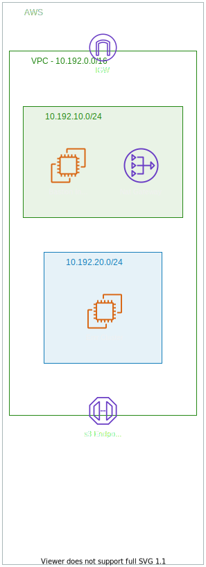

# cookiecutter-pyspark-cloud 

[](https://forthebadge.com)[](https://forthebadge.com)

[](https://opensource.org/licenses/Apache-2.0)


Run PySpark code in the 'cloud' with Amazon Web Services (AWS) Elastic MapReduce (EMR) service in a few simple steps with
 this [cookiecutter](https://cookiecutter.readthedocs.io/en/1.7.2/usage.html) project template!

## Quickstart

```
pip install -U "cookiecutter>=1.7"
cookiecutter --no-input https://github.com/daniel-cortez-stevenson/cookiecutter-pyspark-cloud.git
cd pyspark-cloud
make install
pyspark_cloud
```

Your console will look something like:


## Features

- **AWS :cloud: Cloudformation Template for EMR:** Simple Spark cluster deployment with infrastructure as code

    - [JupyterHub](https://jupyterhub.readthedocs.io/en/stable/) is installed to the EMR Master node for development, and is backed by AWS S3 for persistent storage
    - [JupyterLab](https://jupyterlab.readthedocs.io/en/stable/) endpoint available at https://master-dns:9443/lab 
    - Jupyter Notebook :notebook_with_decorative_cover: endpoint available at https://master-dns:9443/tree with [sparkmagic](https://github.com/jupyter-incubator/sparkmagic) kernel
    - Includes examples of bootstrapping your cluster with bash scripts and EMR Steps :eyes:

- **A Command-Line Interface for Running PySpark 'Jobs':** For production :rocket: runs via [EMR Step API](https://docs.aws.amazon.com/emr/latest/ManagementGuide/emr-work-with-steps.html)

    - Uses the concept of 'jobs', which run PySpark scripts as a Python function via a common entrypoint - **this an important point**
    - Checkout the [Medium article, which inspired a lot of this](https://developerzen.com/best-practices-writing-production-grade-pyspark-jobs-cb688ac4d20f?gi=6a9d5b0fded4#.wg3iv4kie)

- **Log Like a Pro:** Save time debugging _in style_ :dancer:

- **Wrap Scala with Python :snake::** Use libraries that haven't been included in the PySpark API!

    - An example of wrapping Scala Spark API code with PySpark API code is provided with `SnowballStemmer`
    - Could be extended to other [Scala MLlib](https://spark.apache.org/docs/1.2.1/mllib-guide.html) classes (and other Scala classes that implement the UDF interface)

- **Simplify Workflows with Make :white_check_mark::** A Makefile with commands for installation, development, and deployment.

    - use with `make [COMMAND]`
    - For example, distribute an executable .egg :egg: distribution of your PySpark code to AWS S3 with `make s3dist`

- **Organize Your Code:** Package code shared between 'jobs' in a Python module of your package
 called `common`

- **Extend the PySpark API:** An example of extending the PySpark SQL `DataFrame` class, which allows chaining custom
 transformations with dot `.` notation

    - checkout this [awesome PySpark utilities & extensions repo Quinn](https://github.com/MrPowers/quinn)

- **Development Framework:** All the tools you need

    - Use [bump2version](https://github.com/c4urself/bump2version) to version your project
    - Use [CodeCov](https://codecov.io/) to track the completeness of unit tests - see [codecov.yml](/{{cookiecutter.repo_name}}/codecov.yml)
    - Use [Flake8] to write Python code with [common style & formatting conventions](https://www.python.org/dev/peps/pep-0008/)

## Infrastructure Overview

As defined in the [Cloudformation template](/{{cookiecutter.repo_name}}/cloudformation/emr-template.yaml)


## Usage

1. Clone this repo:

```
git clone https://github.com/daniel-cortez-stevenson/cookiecutter-pyspark-cloud.git
cd cookiecutter-pyspark-cloud
```

2. Create a Python environment with dependencies installed:

```
conda create -n cookiecutter -y "python=3.7"
pip install -r requirements.txt

conda activate cookiecutter
```

3. Make any changes to the template, as you wish.

4. Create your project from the template:

```
cd ..
cookiecutter ./cookiecutter-pyspark-cloud
```

5. Initialize git:

```
cd *your-repo_name*
git init
git add .
git commit -m "Initial Commit"
```

6. Create a new Conda environment for your new project & install project development dependenices:

```
conda deactivate
conda create -n *your-repo_name* -y "python=3.6"

make install-dev
```

## Contribute

Contributions are welcome! Thanks!

**[Submit an Bug or Feature Request](https://github.com/daniel-cortez-stevenson/cookiecutter-pyspark-cloud/issues/new)**

**[Submit a Pull Request](https://github.com/daniel-cortez-stevenson/cookiecutter-pyspark-cloud/compare)**

## Acknowledgements

Most of the ideas expressed in this repo are not new, but rather expressed in a new way. Thanks, folks! :raised_hands:

- [@MrPowers](https://github.com/MrPowers) for the `DataFrame` extension snippet
- [@ekampf](https://github.com/ekampf) for the original concept for the [pyspark_entrypoint](/{{cookiecutter.repo_name}}/{{cookiecutter.package_name}}/pyspark_entrypoint.py)
