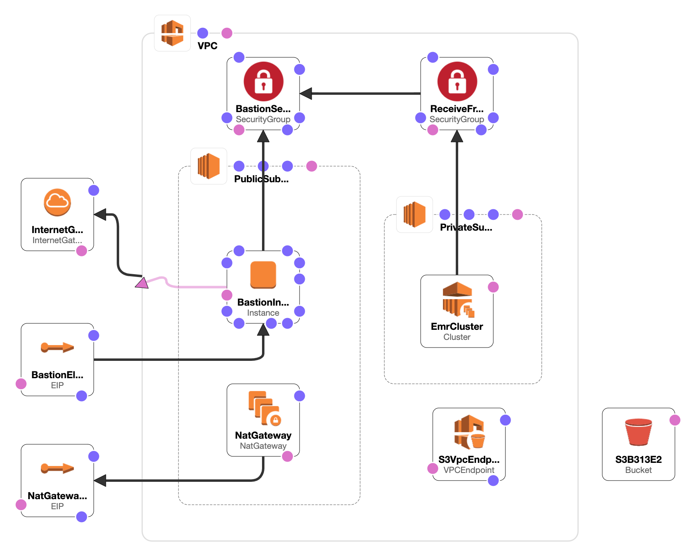

# cookiecutter-pyspark-cloud 

[](https://opensource.org/licenses/Apache-2.0)

Run PySpark code in the 'cloud' with Amazon Web Services (AWS) Elastic MapReduce (EMR) service in a few simple steps with
 this [cookiecutter](https://cookiecutter.readthedocs.io/en/1.7.2/usage.html) project template!

## Quickstart

```
pip install -U "cookiecutter>=1.7"
cookiecutter --no-input https://github.com/daniel-cortez-stevenson/cookiecutter-pyspark-cloud.git
cd pyspark-cloud
make install
pyspark_cloud
```

Your console will look something like:


## Infrastructure Overview



## Usage

1. Clone this repo:

```
git clone https://github.com/daniel-cortez-stevenson/cookiecutter-pyspark-cloud.git
cd cookiecutter-pyspark-cloud
```

2. Create a Python environment with dependencies installed:

```
conda create -n cookiecutter -y "python=3.7"
pip install -r requirements.txt

conda activate cookiecutter
```

3. Make any changes to the template, as you wish.

4. Create your project from the template:

```
cd ..
cookiecutter ./cookiecutter-pyspark-cloud
```

5. Initialize git:

```
cd *your-repo_name*
git init
git add .
git commit -m "Initial Commit"
```

6. Create a new Conda environment for your new project & install project development dependenices:

```
conda deactivate
conda create -n *your-repo_name* -y "python=3.6"

make install-dev
```

## Features

- AWS Clouformation Template for EMR: Simple Spark cluster deployment with infrastructure as code

    - [JupyterHub](https://jupyterhub.readthedocs.io/en/stable/) is installed to the EMR Master node for development.

- Simplify Workflows with Make: A Makefile with commands for installation and deployment

    - Installation for regular-use and development
    - Package and deploy your code to AWS S3

- A Command-Line Interface for Running PySpark 'Jobs': For Production runs via EMR Step API.

    - Uses the concept of 'jobs', which run PySpark scripts as a Python function via a common entrypoint.

- Reduce Duplication in Your PySpark Code: Package code shared between 'jobs' in a Python module of your package
 called `common`

- Wrap Scala with Python: An example of wrapping Scala Spark API code with PySpark API code is provided with
 `SnowballStemmer`

- Extend the PySpark API: An example of extending the PySpark SQL `DataFrame` class, which allows chaining custom
 transformations with dot `.` notation

- Development Framework: Use [bump2version](https://github.com/c4urself/bump2version) to version your project.

## Contribute

Contributions are welcome!

- [Submit an Issue](https://github.com/daniel-cortez-stevenson/cookiecutter-pyspark-cloud/issues/new)

- [Submit a Pull Request](https://github.com/daniel-cortez-stevenson/cookiecutter-pyspark-cloud/compare)
